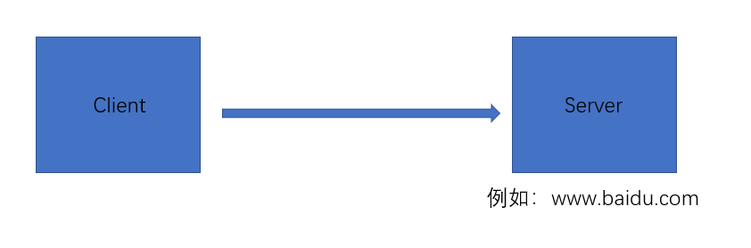
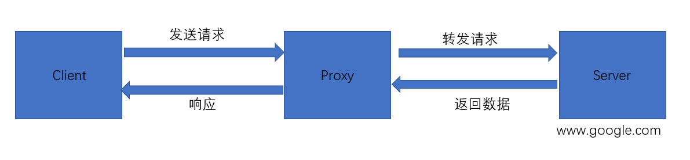
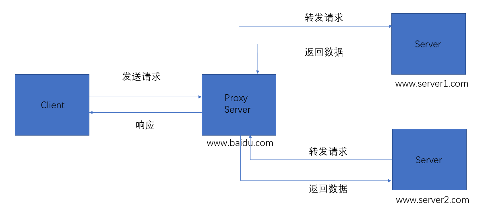
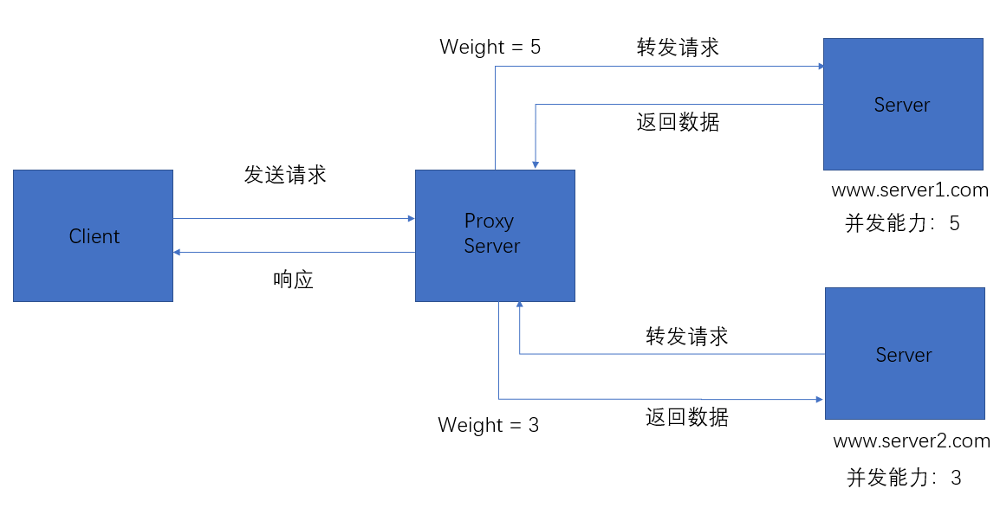

服务器项目上线

## 基本概念

### 代理

为了讲清楚代理这个概念，考虑下面的情况。
我们正常访问服务器可以通过下面的方式：(忽略 DNS 解析过程)


但是，对于一些网址，我们并不能直接访问，例如：www.google.com。这个时候我们就需要引入一个类似于中间人，让他来帮我们访问 www.google.com，然后再将请求到的结果再返回给我们。


#### 正向代理

类似上面的情况，我们想要访问服务器，然后我们通过代理，它帮我们获取服务器响应。这种代理称之为正向代理。

#### 反向代理

与正向代理不同，反向代理是为服务器中代理，来看下面的示意图：


正向代理与反向代理原理类似，不用的是，我们再反向代理中，我们只能访问到代理服务器，例如上图中的 www.baidu.com，但是我们无法直接访问 www.server1.com 和 www.server2.com，也就是说反向代理可以为我们隐藏真实的服务器。

那么肯定有人会问了，既然我们也可以直接访问真实的服务器，那么为什么我们还需要反向代理呢？
考虑下面的情况：
假设公司为了加快响应速度，采用了分布式集群，例如，将静态资源存放在 www.static.com 域名下的服务器，将动态资源存放在 www.dynamic.com 域名下的服务器。然而，用户返回服务器时，压根就不会去区分是静态资源还是动态资源，用户关心的得到对应的响应。也就是说，用户只需要访问 www.resource.com 就能得到对应的响应。

对应上面的情形，我们就需要引入一个代理来处理用户的请求，对于不同的请求转发到不同的服务器上，这样用户只需要访问 www.resource.com 就能得到对应的响应，这样岂不美哉，而且这样用户还不需要记住不同的网址，只需要知道主网址即可。

在上述例子中，我们访问 www.resource.com 对应的服务器就是充当反向代理服务器。事实上，使用代理服务器的好处还有很多。
既然我们在执行代理的过程就是将用户的请求转发到不同的服务器上，那么，我们在转发的过程中我们可以添加一些额外的功能，例如根据不同服务器的并发能力，转发相应的请求，也就是负载均衡。

### 负载均衡

在解释负载均衡之前，来看下面的例子：


Server1 并发处理能力为 5 颗星，Server2 并发处理能力为 3 颗星。很明显两台服务器的并发能力并不相同，假设两天服务器对处理的是同样的请求，可能 Server1 的配置会好一点，而 Server2 的配置要弱一点，那么对于用户发送给反向代理服务器请求后，在转发的过程中，我们可以为 Server1 多安排一些请求，例如：每 8 个请求就转发 5 个给 Server1，剩下 3 个请求就转发给 Server2，从而有效利用服务器资源，加快相应速度。

代理服务器实现上述功能称之为负载均衡，按照服务器的处理能力而制定的转发规则就是分配权重(weight)的过程，例如上述的 Server1，每 8 个请求就转发 5 个，全值为 5/8。

### 动静分离

既然代理服务器能实现负载均衡，那它也可以实现动静分离，也就是动态资源和静态资源请求分离。
其原理大致为代理服务器设置请求路径的匹配规则（可以用正则匹配），不同的请求路径转发给不同的服务器，这样就能够实现动静分离。

## 具体配置

### 总体配置

```config
# 全局配置
worker_process auto;

events {
  worker_connections 1024;
}

http {
  # http配置，例如配置证书等

  # 负载均衡配置
  upstream xxx {}

  # 配置服务器
  server {
    # 请求路径配置，可用正则表达式.
    location __ {}
  }
}
```

里面最重要的配置就是 server 的配置。其他配置可用参考文档进行相应配置。

### 实例：实现简单地负载均衡
```config
# /etc/nginx/nginx.conf
http {
  # 负载均衡配置
  upstream blog {
    # server 127.0.0.1 weight=1;
    server 127.0.0.1;
  }
}
```

```config
# /etc/nginx/sites-enabled/server.conf
server {
  listen 80;
  server_name blog;
  location / {
    proxy pass http://blog;
    proxy_set_header X-Forwarded-Proto $scheme;
    proxy_set_header Host $http_x_forwarded_host;
    proxy_http_version 1.1;
    proxy_set_header Upgrade $http_upgrade;
    proxy_set_header Connection "upgrade";
    proxy_set_header X-Forwarded-For $proxy_add_x_forwarded_for;
    proxy_read_timeout 3m;
    proxy_send_timeout 3m;
  }
}
```
