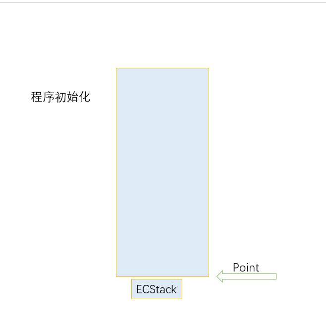
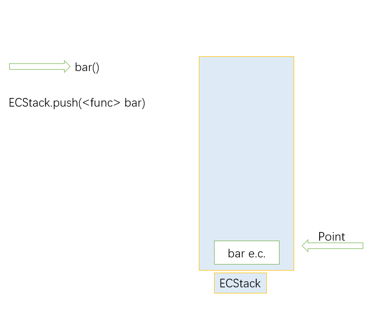
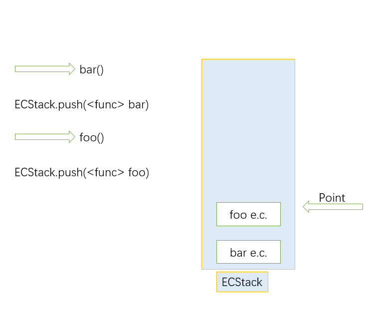
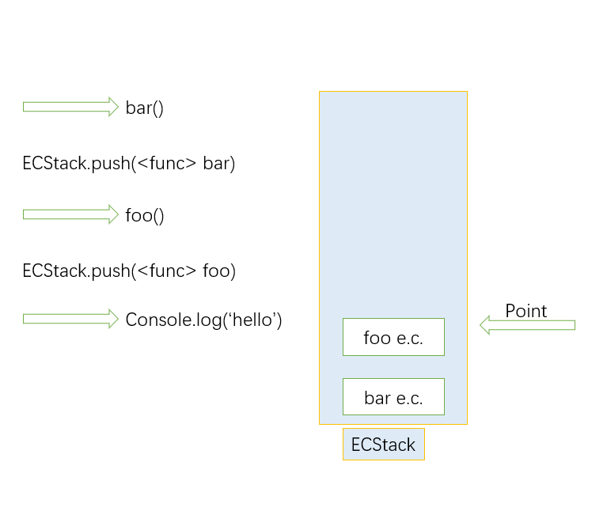
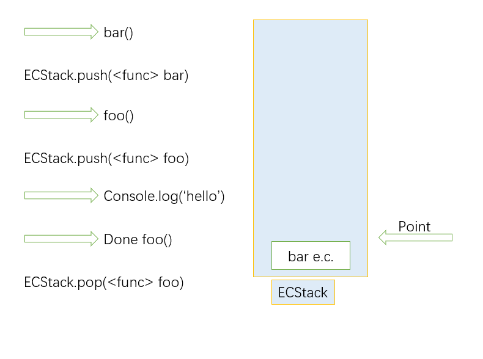
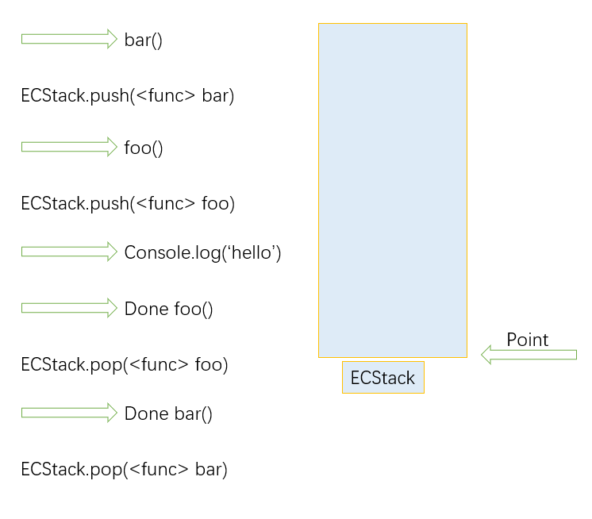

## 引例

来看《javascript 权威指南》中的例子：

```js
var scope = 'global scope'
function checkscope() {
  var scope = 'local scope'
  function f() {
    return scope
  }
  return f()
}
checkscope()
```

```js
var scope = 'global scope'
function checkscope() {
  var scope = 'local scope'
  function f() {
    return scope
  }
  return f
}
checkscope()()
```

请问上述的两段代码会输出什么，它们之间又有什么不同呢？

通过运行上面两段代码，我们可用发现控制台将会输出`local scope`，那么这两段代码究竟有什么不同呢？在解决这个问题之前，我们先来了解一下函数的执行过程。

## 函数执行过程

函数的执行就是进栈和出栈的过程（事实上，js 文件也可以看成是一个全局函数）。
Js 引擎在执行 js 代码时会创建一个执行上下文栈（execute context stack）来管理执行上下文。
以函数为例。当执行一个函数时，js 引擎就会创建一个上下文栈来管理函数的作用域。考虑下面的例子：

```js
function foo() {
  console.log('hello')
}
function bar() {
  foo()
}

bar()
```

具体的执行过程如下：
js 解释器从上到下解释 js 代码，遇到函数(`foo`, `bar`)就先跳过，所以，首先开始执行`bar()`。

1. 程序初始化。创建执行上下文栈（ECStack）
   
2. 开始执行`bar()`。将`bar`函数的执行上下文（e.c.）推入栈中。
   
3. 进入`bar`函数中，执行内部代码。执行`foo()`。
   
4. 进入`foo`函数中，执行内部代码。执行`console.log('hello')`。（这里忽略系统函数内部的执行步骤）
   
5. 执行完`foo`函数。将`foo`函数的执行上下文出栈。
   
6. 执行完`bar`函数。将`bar`函数的执行上下文出栈。
   
7. 代码执行完，开始执行清理操作。

## 回到最初的问题
我们之前所执行的两段代码结果相同，那么它的不同之处就是在于执行过程的上下文中不同。用伪代码来描述两段代码的执行过程：
```js
ECStack.push(<func> checkscope)
ECStack.push(<func> f)
ECStack.pop(<func> f)
ESCStack.pop(<func> checkscope)
```

```js
ECStack.push(<func> checkscope)
ESCStack.pop(<func> checkscope)
ECStack.push(<func> f)
ECStack.pop(<func> f)
```
## reference

- [JavaScript 深入之执行上下文栈](https://github.com/mqyqingfeng/Blog/issues/4)
