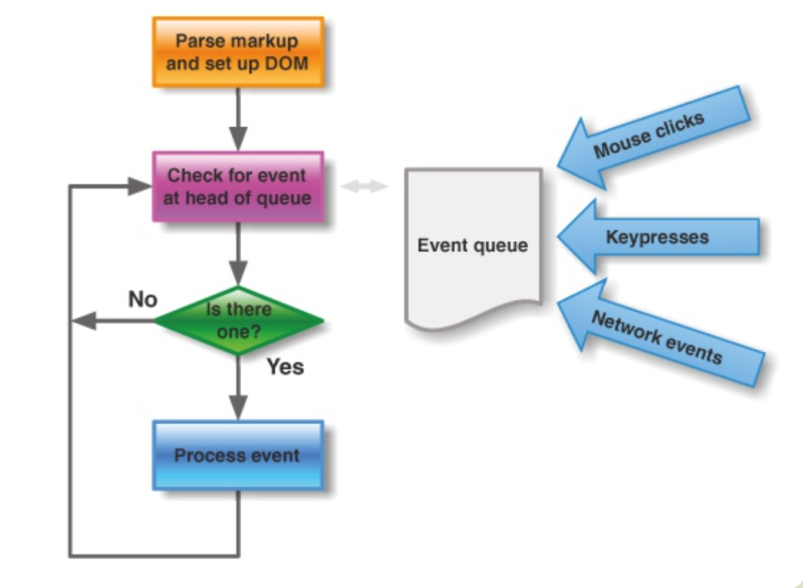
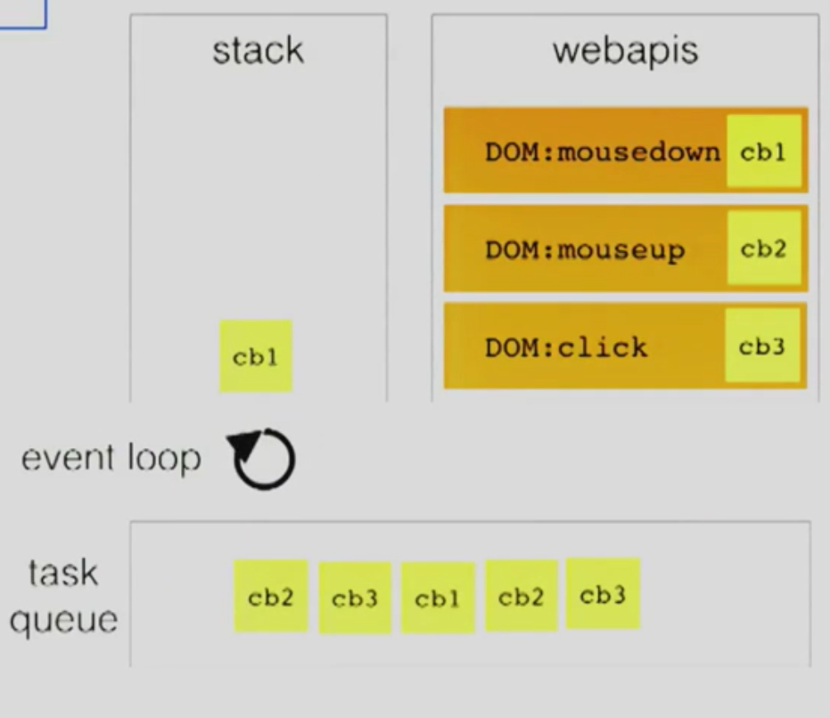
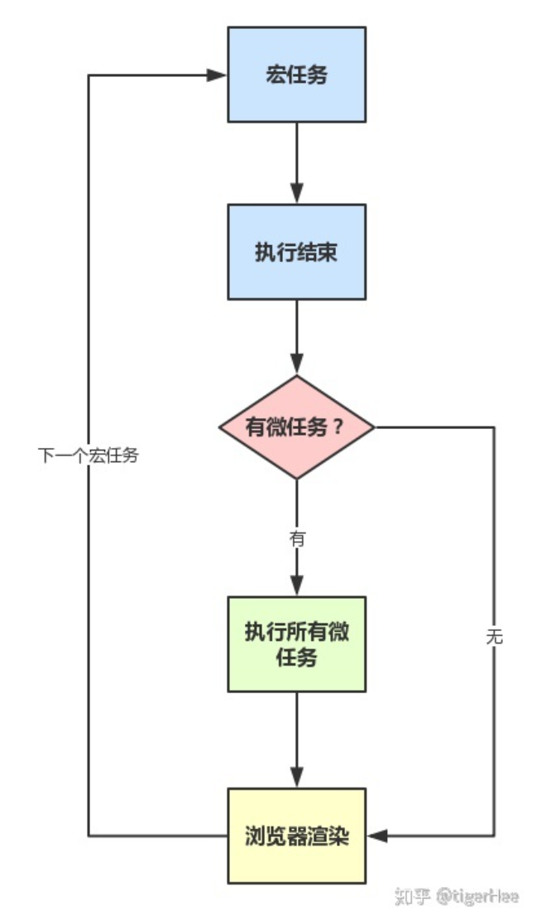
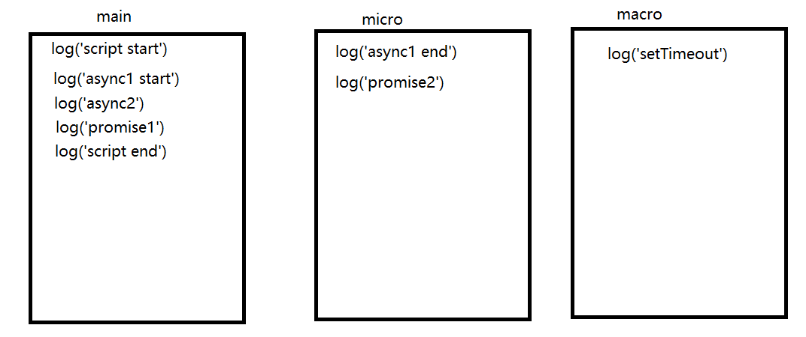
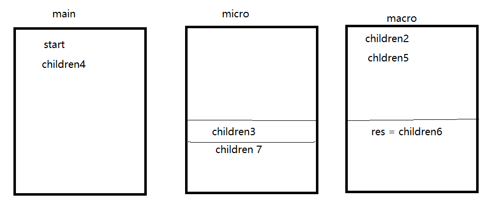

## javascript 为什么需要 event loop?

在回答这个问题之前，我们应该要知道 javascript 是一个单线程的编程语言。
为什么 javascript 是单线程语言？
主要因为 JavaScript 作为浏览器的脚本语言，主要用途是与用户交互，以及操作 DOM 元素，这就决定它在同一时刻只能执行一种操作。

如果像其他编程语言一样允许多线程，则很容易出现线程安全问题。不过也有新的方案使 javascript 支持多线程，例如：`WebWorker`，但是它是有条件的多线程。

再回到最初的问题，为什么需要 event loop，主要由于 js 是单线程的，容易出现阻塞导致出现一种卡顿现象。但是又不能简单粗暴地使用多线程，为了充分利用 CPU 的计算能力，当充分阻塞 I/O 时，可以将其挂起，等到出结果再去直线，于是就有了任务的概念。

在 js 中，任务分为两种：

- 同步任务。
  同步任务指的是在主线程运行的任务，只有前一个任务执行完毕，才能继续执行下一个任务。
- 异步任务。
  异步任务指的是不进入主线程而是进入“任务队列”执行的任务。异步任务不会阻塞同步任务的执行。

1. 所有的同步任务都在主线程上执行，形成一个执行栈(executing context)。
2. 主线程之外，还有一个“任务队列”，用于存放异步任务。只要异步任务执行有了结果就在任务队列中放置一个事件。
3. 一旦执行栈中的任务完成，系统就会去读取”任务队列“，并查看有没有待执行的事件。对应的那些异步任务将会停止等待，放入到执行栈中，等待执行。
4. 主线程不断地重复执行上述 3 个步骤。

具体的过程可以参看如下图：


通过图我们可以看到，只有主线程杀那个没有任务，主线程才会去查看任务队列。值得一提的是在 js 中每一次的事件循环称之为一帧`tick`。

## 任务队列与回调

"任务队列"也称消息队列，是一个事件队列。当 I/O 完成或者类似于鼠标点击等事件完成后，会往任务队列里面存放一个事件（消息）告诉主线程，对应的异步任务可以进入执行栈中。

所谓的回调函数（callback）是指那行被主线程挂起的代码。异步任务完成后需要**指定回调函数**，主线程执行异步任务的过程也就是执行回调函数的过程。

## 事件循环

事件循环指的是主线程从任务队列中读取事件，执行实现，不断往复的过程。


## 定时器（timer）

除了往任务队列里面存放异步任务外，可以存放定时器，在 js 中主要有`setTimeout`和`setInterval`。前者是一次性执行，而后者是不断循环往复执行。

**值得注意的是**由于定时器是存放在任务队列中，需要等到主线程执行栈执行完毕后，才会去执行那些到时定时器的回调。这就是为什么哪怕是`setTimeout(callback, 0)`也不是立刻执行的原因。

## 宏任务与微任务

### 宏任务

我们上面所说的任务队列就是一个宏任务。浏览器为了让任务队列（宏任务）的执行与 DOM 渲染能够有序执行，会在在下个宏任务执行之前对页面重新渲染。即

```sh
宏任务==>渲染==>宏任务==>渲染...
```

常见的宏任务有：

```sh
script(整体代码)
setTimeout
setInterval
I/O
UI交互事件。click, mouseenter, ...
postMessage
MessageChannel
setImmediate(Node.js)
```

### 微任务

宏任务能够保证任务队列的执行与 DOM 渲染能有序执行。但是在某型场景下，我们执行的异步代码又不需要保证 DOM 渲染有序执行，甚至没有对 DOM 进行操作。但是执行完一个宏任务会对页面进行一次渲染，这样会影响性能，对于某些场景，我们可以忽略渲染过程，直接执行异步代码，这就是微任务的作用。

微任务会在执行栈中为空，或者执行完一个宏任务后进行微任务队列里面**所有的**任务。
常见的微任务有：

```sh
Promise.then
Object.observe
MutationObserver
process.nextTick(Node.js 环境)
```

整个过程可以用下面一张图表示：


## nodejs 中的任务队列

nodejs(js)中无法实现`first-in-first-handle`或`first-finish-first-handle`的异步处理机制。这是由于异步任务中可能还嵌套着其他异步任务。如果按照以上的其中一种规则执行，这就意味着，需要把当前的异步任务完全执行完毕（包括嵌套的异步任务），才能执行下一个任务队列中下一个异步任务。出于多种情况考虑，最好在执行之前先制定好规则。

### 调用栈，事件循环和事件队列(the call stack, event loop and callback queues)

> 调用栈：当执行一个函数时，会将函数的上下文（包括局部变量等）推入一个栈中。
> 事件队列保留异步操作需要执行的回调函数。和普通的队列一样也是先进先出。

#### 回调队列的类型

- IO queue
- Timer queue
- Micro task queue
- Check queue (also known as immediate queue)
- Close queue

##### IO queue

由于 js 无法直接进行 IO 操作，对于 IO 操作 js 会转交给 nodejs 进行处理。
处理完成后，它们会被转移到 IO 回调队列中，进行事件循环，以转移到执行栈中执行。

##### Timer queue

涉及到定时器的操作都需要被添加到 Timer queue 中，所有的定时器操作都是异步的。js 会将时间相关的操作转交到 nodejs 执行，完成后将其添加到定时器队列中。(可以参考: [Some Javascript features are actually Browser APIs](https://dillionmegida.com/p/browser-apis-and-javascript/#javascript-on-nodejs))

##### micro-task queue

微任务队列分为两种：

- 由`process.nextTick`而延时的函数
- 由`promises`而延时的函数。例如 pending，callback 待定的回调。

`process.nextTick`是一个（`tick`，即下一次事件循环）执行的函数。微任务对队列需要存放此函数，以便在下一帧时执行微任务。
这意味着事件循环会在每一次执行其他队列之前，去检查微任务队列中是否有此类函数。**说明微任务的优先级要高于其他任务**。

`promise`的初始变量会存储在 js 的内存中。nodejs 会将`promise`的"回调函数"(then 传入的函数，或者 catch 等传入的函数)放入微任务队列中，同时用得到的结果来更新 js 内存中的变量。

##### check queue

check queue 也叫 immediate queue。当 IO queue 中的所有回调函数执行完毕后，立刻执行该队列中的回调函数。用`setImmediate`可以往该队列中添加回调函数。（！！有待验证）

##### close queue

存放关闭操作的回调函数。例如：`http close event`，`stream close event`。

### 执行顺序

1. micro-task queue
2. timer queue
3. I/O queue
4. check queue
5. close queue

## 示例

### 示例 1

```ts
// event loop: micro-task, macro-task and task
console.log('main: 1')

setTimeout(() => console.log('macro-task: 1'))
Promise.resolve().then(() => console.log('micro-task: 1'))
setTimeout(() => console.log('macro-task: 2'))
Promise.resolve().then(() => console.log('micro-task: 2'))

console.log('main: 2')
/**
 * main: 1
 * main: 2
 * micro-task: 1
 * micro-task: 2
 * macro-task: 1
 * macro-task: 2
 */
```

从上面示例可以验证：js 会先执行主线程的任务，只有当主线程任务执行完毕后，才会去查看任务队列（宏任务，微任务）中是否有任务需要执行。并且微任务的优先级要宏任务。

### 示例 2

```ts
async function async1() {
  console.log('async1 start')
  await async2()
  console.log('async1 end')
}

async function async2() {
  console.log('async2')
}

console.log('script start')

setTimeout(() => {
  console.log('setTimeout')
}, 0)

async1()
new Promise((resolve) => {
  console.log('promise1')
  resolve()
}).then(() => console.log('promise2'))

console.log('script end')
```

具体的执行过程如下：

里面需要注意的点是`await`。`await xxx() == new Promise(resolve => {xxx(); resolve();})`
这就是为什么先输出`async2`然后才输出`promise1`。

### 示例 3

```js
console.log('start')
setTimeout(() => {
  console.log('children2')
  Promise.resolve().then(() => {
    console.log('children3')
  })
}, 0)

new Promise((resolve) => {
  console.log('children 4')
  setTimeout(() => {
    console.log('children 5')
    resolve('children 6')
  }, 0)
}).then((res) => {
  console.log('children 7')
  setTimeout(() => {
    console.log(res)
  }, 0)
})

// start
// children 4
// children 2
// children 3
// children 5
// children 7
// children 6
```
执行过程如下：

主线程执行，输出`start`（line 1），遇到宏任务/微任务（line 2-7，line 11-20），则放入对应的任务队列中。`new Promise`中的同步代码属于主线程的执行代码，所以输出`children4`（line 10），然后开始执行任务队列中的代码。

一开始微任务队列中没有任务，所以开始执行宏任务（line 3-6）。输出`children2`，同时将一个微任务推入微任务队列中。为什么之后就输出`children3`？我们来看对应的宏任务回调的代码：

```ts
setTimeout(() => {
  console.log('children2')
  Promise.resolve().then(() => {
    console.log('children3')
  })
}, 0)
```
由于在执行该宏任务的时候，会将`children3`推进微任务任务队列中，而宏任务执行结束，系统回去清空微任务队列，于是输出`children3`。

接着继续执行下一个宏任务（line11 - 14），也就是第二个定时器。输出`children 5`。同时`resolve('children 6')`将`premise`中的回调推入微任务队列中。
执行完宏任务后，当前宏任务队列已经为空，开始清空微任务队列。于是输出`children 7`。同时又创建了一个宏任务（line 17-19），执行完微任务，继续执行宏任务输出`res = children 6`。至此，任务队列为空，所有的任务执行完毕。

### 示例4
```ts
const p = function () {
  return new Promise((resolve) => {
    const p1 = new Promise((resolve) => {
      setTimeout(() => {
        resolve(1)
      }, 0)
      resolve(2)
    })

    p1.then((res) => {
      console.log(res)
    })
    console.log(3)
    resolve(4)
  })
}

p().then((res) => {
  console.log(res)
})
console.log('end')

// 3
// end
// 2
// 4
```
## reference

- [JavaScript 运行机制详解：再谈 Event Loop](http://www.ruanyifeng.com/blog/2014/10/event-loop.html)
- [js 中的宏任务与微任务](https://zhuanlan.zhihu.com/p/78113300)
- [深入了解 Node.js 的队列](https://www.html.cn/web/node-js/20035.html)
- [Some Javascript features are actually Browser APIs](https://dillionmegida.com/p/browser-apis-and-javascript/#javascript-on-nodejs)
- [《Help, I'm stuck in an event-loop》](https://vimeo.com/96425312)
- [A deep dive into queues in Node.js](https://blog.logrocket.com/a-deep-dive-into-queues-in-node-js/)
