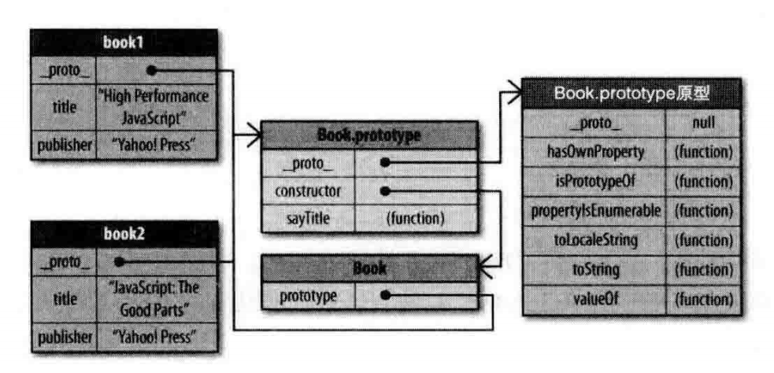
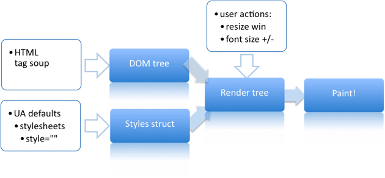

## 写在前面

本篇文章是我在阅读《高性能 javascript》后所写的笔记，只会记录书本中一些比较重要的知识点，所以笔记可能没有那么全面。但是，对于某些重要的概念，通过阅读其他博客，我也对其进行拓展。比如：网页性能管理和事件委托等。

## 加载与执行

### 脚本的位置

1.浏览器引擎在遇到`<script>`标签会执行 js 代码。这会导致页面渲染阻塞，直到 js 代码执行完毕。
所以，一般而言，会将`script`标签放置在`</body>`闭合标签之前。除了不会影响浏览器渲染页面之外，还有就是 js 在操作 DOM 元素必须等到 DOM 加载完成才能操作对应的元素，将`<script>`标签放在`</body>`前可以确保 DOM 元素加载完成。

### 非阻塞`script`

- `defer`：异步加载。当 DOM 渲染完成后才执行 js 代码
- `async`：异步加载。加载完成立即执行。
- 使用`XMLHttpRequest`请求外部的 js 代码，然后创建`script`标签，将请求到的代码写到`script`标签中，实现动态加载。

## 数据存储

### 管理作用域

#### 不同类型的变量获取速度不同。

一般而言：本地变量，字面量 > 数组元素，对象成员。所以如果需要多次使用同一个对象/对象成员/数组/数组元素，可以将其用局部变量保存起来，提高访问速度。

#### 改变作用域链

使用 try/catch 会修改作用域链：

```js
try {
} catch (err) {
  // 作用域链在这里发生改变
  // err对应的作用域链太长
  handleErr(err)
}
```

由于 err 对应的作用域链太长，如果对异常的处理逻辑过长，可以使用一个函数对异常进行处理。

#### 闭包、作用域和内存

使用闭包延长作用域的同时，会导致作用域链太长，影响访问变量的速度。
解决办法之一就是可以把闭包用到的变量用一个局部变量保存下来。

```js
/* object_member1.js */

function curry(x): any {
  return function (y) {
    const _x = x
    // statements...
    return _x + y
  }
}
```

### 对象成员

在 js 中，对象成员包括成员属性和成员方法。在前面我们已经了解过，访问对象成员的速度要比访问局部变量和字面量慢，这涉及到 js 中对象的本质。下面我们将一一道出。

#### 原型

与其他编程语言不同，js 中的对象是基于原型实现的。对象通过一个内部属性(**proto**绑定到它的原型。一旦我们创建一个对象（例如 Array 或者 Object）就会自动拥有一个 Object 实例作为原型。
（大部分浏览器已经支持`__proto__`访问对象原型，但是比较正式的用法是`Object.getPrototypeOf(obj)`）
因此，对象可以有两种成员类型：实例成员（也称 own property）和原型成员。实例成员直接存放在对象实例中，原型成员则是成对象原型链继承下来的。
（实例成员相当于其他语言中，类属性，而原型成员相当于父类属性）
来看下面的一个例子：

```js
/* object_member2.js*/

const book = {
  title: 'high performance javascript',
  publisher: 'Yahoo!!!!'
}

console.log(book.toString())
// [object Object]
```

我们创建一个`book`对象，其中只包含两个成员属性`title`和`publisher`，我们并没有声明`toString`方法，但是使用打印输出时却可以正常访问，这是因为当`book.toString()`调用时，会先从`book`对象的成员属性开始查找，如果还没找到，就会到`book`的原型属性查找，在 js 中所有的对象默认会继承至`Object`，而`Object`中含有`toString`方法，于是我们使用`book.toString()`并不会报错。来看下面的例子：

```js
/* object_member3.js */

const obj = Object.create(null)
// null
console.log(Object.getPrototypeOf(obj))
// undefined
console.log(obj.toString)
```

我们使用`Object.create()`它会将传入的对象作为新对象的原型，这里我们使用了`null`，这样新创建出来的对象就不具备有原型属性。这样可以节省一些不必要的开支。

如果需要判断某个属性是否为实例属性，或者获取对象的实例属性可以通过下面的方式获取：

```js
/* object_member4.js */

const book = {
  title: 'high performance javascript',
  publisher: 'yahoo'
}

// true
console.log(book.hasOwnProperty('title'))
// false
console.log(book.hasOwnProperty('toString'))
// [ 'title', 'publisher' ]
console.log(Object.getOwnPropertyNames(book))
```

如果需要判断某个属性是否存在可以使用如下方式：

```js
// true
console.log('title' in book)
// true
console.log(Reflect.has(book, 'toString'))
```

::: tip 小技巧
如果我们不需要`Object`的原型方法时，我们可以通过`Object.create(null)`创建对象。
如果我们不需要遍历对象的原型时，我们应该使用`for (const key of obj.keys())`进行遍历，这样的效率会高一些。
:::

#### 原型链

对象的原型决定了实例的类型。默认情况所有的对象都继承自`Object`，当然我们也可以定义构造函数来创建另一种原型的原型：

```js
/* object_member5.js */

function Book(title, publisher) {
  this.title = title
  title.publisher = publisher
}

Book.prototype.sayTitle = function () {
  console.log(this.title)
}

const book1 = new Book('book1', 'publisher1')
// true
console.log(book1 instanceof Book)
// true
console.log(book1 instanceof Object)

// book1
book1.sayTitle()

// [object Object]
console.log(book1.toString())
```

对应的原型链为：


其中`book1.toString`继承自`Object`，在搜索`book1.toString`的过程中，随着原型链越深，访问速度随着变慢。所以，可以通过局部变量先进行缓存。

::: danger 注意事项
对于对象的成员方法，使用局部变量缓存可能会导致内部的`this`指向发生改变。
:::

## DOM 编程

文档对象模型(DOM)是独立于编程语言存在的。在浏览器中的接口是通过 js 实现的。由于两者是相互独立的，这就意味着通过 js 访问 DOM 元素天生就是慢，我们可以把 js 和 DOM 想象为两个岛屿，它们之间通过收费桥梁连接，js 每次访问 DOM 都需要经过这座桥梁，每次都需要交纳过桥费，于是访问 DOM 的次数越多，费用越高。因此，应该尽可能地减少对 DOM 的访问。

### DOM 的访问与修改

考虑下面例子：

```js
function innerHtmlLoop() {
  for (let i = 0; i < 1000; i++) {
    document.querySelector('div').innerHTML += 'a'
  }
}
```

虽然我们不会直接写成这种代码，但是通过这个例子我们可以来分析性能。这里每一次循环都修改 DOM 元素的`innerHTML`，这样做的开销极大，一种优化方案为：

```js
function innerHtmlLoop() {
  let content = ''
  for (let i = 0; i < 1000; i++) {
    content += 'a'
  }
  document.querySelector('div').innerHTML = content
}
```

这样我们就把多次访问 DOM 元素转换成 1 此访问，从而减少不必要的开销。

### 网页性能

#### 网页的生成过程

在讲重绘和重排之前，让我们先了解一下网页的生成过程。
网页的生成过程可以大致分为如下 5 个步骤：

1. HTML 代码转化为 DOM
2. CSS 代码转化为 CSSOM（css Object Model）
3. 结合 DOM 和 CSSOM 生成一颗渲染树（生成结点信息）
4. 生成布局（layout），即将所有的渲染树的所有结点进行平面合成
5. 将布局绘制（paint）在屏幕上。


从 1 到 3 的执行速度非常快，生成布局和布局绘制称之为渲染过程，这个过程是非常耗时的。


#### 重绘与重排

在了解完网页的生成过程后，我们就可以来讲一下重绘和重排了。
网页在生成的时候，至少会渲染一次。用户访问的过程中，还会不断地重新渲染。
常见的几种情况化导致网页的重新渲染：

- 修改 DOM
- 修改 style
- 用户事件。(click，mouseover...)

重新渲染的过程需要重新生成布局和重新绘制。
**重新生成布局的过程称为重排(reflow)**，**重新绘制的过程称为重绘(repaint)**。

::: warning
重绘不一定会导致重排。例如：修改每一个 DOM 元素的`background-color`，这会导致页面的重绘。

重排一定会导致重绘。例如我们修改了一个 DOM 元素的位置，它会触发网页的重绘和重排，因为布局发生改变了。
:::

重排的发生时机：

- 添加或删除可见的 DOM 元素
- 元素位置发生改变
- 元素的尺寸发生改变（包括：外边距，内边距，边框厚度，宽度，高度等属性）
- 内容发生改变。例如：文本发生改变或者图片被另一张不同尺寸的图片替换。
- 页面渲染初始化
- 浏览器窗口发生改变

总之，涉及到元素变化都会发生重排（可以通过某些技术避免）。

#### 性能的影响

重绘和重排是不可避免的。但是它们确是非常消耗性能的，想要提高网页的性能就必须尽可能地减少重绘和重排的次数。
考虑下面的例子：

```js
div.style.color = 'lightgreen'
div.style.marginTop = '50px'
```

上面的代码会发生两次样式的改变，但是浏览器只会触发一次重绘和重排，这是因为现代浏览器已经对页面元素的修改尽可能集中在一起，排成一个队列然后一次性执行，从而避免多次重新渲染。

但是，如果中间操作不当，仍然会发生多次的重绘和重排：

```js{2}
div.style.color = 'lightgreen'
const mt = parseInt(div.style.marginTop) + 10
div.style.marginTop = `${mt}px'
```

由于我们在第 2 行代码中获取元素的属性，导致浏览器**不得不**立刻执行重排以确保获取到的元素属性是实时的。但是这样做就导致额外的重新渲染了。

所以，从性能的角度上看，尽可能把读写操作分开，可以有效减少重新渲染的次数。例如：

```js
// bad
// 这里会发生3次重排
// 1. 获取div.offsetLeft
// 2. 获取div.offsetTop。(div.style.left会在此次进行重排)
// 3. 修改div.style.top。
div.style.left = div.offsetLeft + 10 + 'px'
div.style.top = div.offsetTop + 10 + 'px'

// good
// 这里只会发生两次重排
// 1. 获取页面元素属性
// 2. 修改页面元素属性
const offsetLeft = div.offsetLeft
const offsetTop = div.offsetTop

div.style.left = offsetLeft + 10 + 'px'
div.style.top = offsetTop + 10 + 'px'

// better
// 我们可以将修改页面元素属性放在同一个操作中，以确保只会发生一次重新渲染。
const offsetLeft = div.offsetLeft
const offsetTop = div.offsetTop

div.style += `left: ${offsetLeft + 10}px; top: ${offsetTop + 10}px;`
```

#### 优化

下面我们列举一些有用的优化方案：

1. 对 DOM 的多次读/写操作放在一起。正如我们上述看到的，对 DOM 多次的读/写操作放在一起可以有效地减少网页的重新渲染。
2. 离线修改 DOM 元素。例如：
   - 隐藏元素，执行修改操作，再将 DOM 放回文档中。
   - 使用文档片段（document fragment）在当前 DOM 之外构建一个子树，再把它的拷贝放回文档中。
   - cloneNode。先复制结点，完成修改后，替换原先的结点。
     例如：先将 DOM 元素设置为`display: none;`，这样需要执行 1 次重绘和重绘，之后再对 DOM 元素进行任意次修改，然后再将`dispaly`设置回原先的状态（这样又放生了 1 次重绘和重排），总共需要 2 次重绘和重排，而中间的修改不会发生重绘和重排。
3. 不要一条条地修改样式，可以通过改变 DOM 元素的`class`或者 csstext 属性，一次性地修改样式。例如：
4. 将`position`属性设置为`absolute`或者`fixed`使 DOM 元素脱离文档流。
5. 使用虚拟 DOM
6. 使用`window.requestAnimationFrame()`、`window.requestIdleCallback()`调节重新渲染。

```js
// bad
div.style.left = 10 + 'px'
div.style.right = 10 + 'px'

// good
// supports .active { left: 10px; right: 10px;}
div.className += 'active'
// or
div.style += 'left: 10px; right: 10px;'
```

#### 事件委托

当页面中存在大量元素，而且每一个都需要一次或多次绑定同一个事件处理器时（例如：click），
这种情况可能会影响性能。因为没绑定一个事件处理器都是有代价的，它要么是加重了页面的负担（需要更多的表用或者 js 代码），要么是增加运行的事件。

一个可行的方案就是通过事件委托（event delegation）的方式进行优化。

下面将一步步引出事件委托的妙用。在讲事件委托之前，先了解一些简单的概念。
事件捕获：自顶向下。
事件冒泡：自底向上。
我们常用的`el.addEventListener('event', callback)`默认就是采用事件冒泡的方式捕获事件，也可以传入第 3 个参数来决定是否使用事件冒泡。`el.addEventListener('event', callback, true)`采用事件捕获。

了解完事件的捕获机制后，我们就可以来讨论一下事件委托了。来看下面的例子：

```html
<ul class="list">
  <li>1</li>
  <li>2</li>
  <li>3</li>
  <li>4</li>
  <li>5</li>
</ul>
```

如果我们想要对`li`添加一个`click`事件，最原始的方式就是通过`for`循环，为每一个`li`添加事件：

```js
const list = document.querySelectorAll('li')
Array.from(list).forEach((el) => {
  el.addEventListener('click', () => {
    alert('click...')
  })
})
```

上面的方式确实没有问题，但是性能太差，但是我们可以用事件委托的方式来实现：
```js
const ul = document.querySelector('.list')
const list = document.querySelectorAll('li')
ul.addEventListener('click', (e) => {
  const target = e.target
  if (target.tagName.toLowerCase() !== 'li') return
  const index = Array.prototype.indexOf.call(list, target)
  alert(`current li: index = ${index}`)
})
```
这里，我们是通过事件委托的方式来实现上面的功能。首先，我们先获取li对应的父元素`ul`，为`ul`添加`click`实现来实现事件委托机制。

这里需要注意的是需要做一下判断。判断当前结点是否为`li`结点。这是因为我们想通过点击`li`来触发响应，但是实际的场景下一个`ul`结点中可能还包含其他结点，使用我们需要判断`target.tagName.toLowerCase() === 'li'`

了解完事件委托机制后，我们来看一下具体的开发场景：我们给每个用户添加了一个属性，`banned = true`，该用户点击页面上的任何按钮或者元素，都不可以响应原来的函数。而是直接`alert`提示，你被封禁了。

一种可行的方案就是为整个页面添加一个透明的`cover`，这样用户点击实际上是点击我们创建的`cover`。另一种方案就是使用事件委托机制：
```js
window.addEventListener('click', (e) => {
  if (banned === true) {
    e.stopPropagation()
  } 
})
```

#### reference

- [网页性能管理详解](http://www.ruanyifeng.com/blog/2015/09/web-page-performance-in-depth.html)
- [爪哇教育 2021 大厂前端核心面试题详解-路白](https://www.bilibili.com/video/BV1zy4y1J7Sf)

### 事件委托

## 算法与流程控制

### 循环

### 递归

### 条件语句

## 字符串与正则

### 字符串

### 正则优化

## 快速响应的用户界面

### 浏览器 UI 线程

### 定时器

### web workers

## Ajax

### 数据传输

### 数据格式

### Ajax 性能指南
