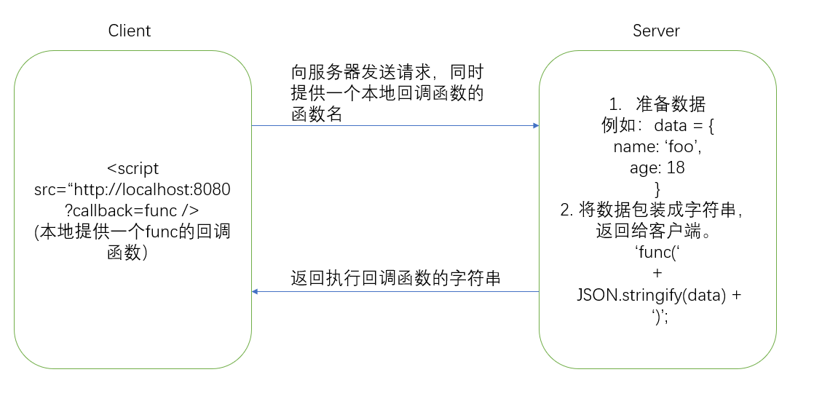
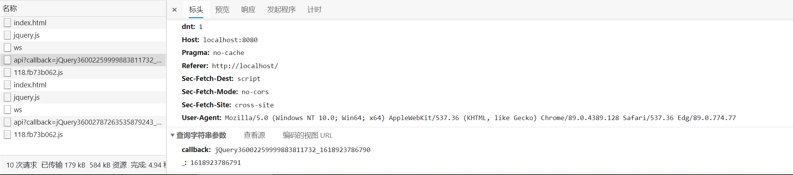

## 何为跨域

> 跨域是浏览器运行向服务器发送跨域请求，从而克服 AJAX 同源策略。

### 何为同源策略

满足一下条件即为同源：

- 协议相同
- 域名相同
- 端口号相同

考虑下面的例子：

```sh
# case1: 协议
http://www.google.com
https://www.google.com

# case2：域名
https://www.google.com
https://www.baidu.com

# case3：端口号
http://localhost:8080
http://localhost:3000
```

case1: 由于协议不相同，一个为 http 协议，一个为 https 协议，所以不属于同源策略。（事实上，http 默认的端口为 80，而 https 默认端口为 403，所以这里可能还存在端口不相同）
case2：由于域名不相同，一个为 www.baidu.com，一个为 www.google.com，所以不属于同源策略。
case3：由于端口号不相同，一个为 8080，一个为 3000，所以不属于同源策略。

下面举一个同源的例子，例如：
http://localhost:8080/api和http://localhost:8080/data

### 为什么需要同源策略

主要是出于安全考虑。设想这样的情况，我们请求不同域名下的资源，例如：`www.domain.com/data`。由于不知道其他域名下的资源是否安全，于是浏览器出于安全考虑，只允许我们访问同源策略下的网站。对于不同源的网站需要客户端和服务器协助解决。如果缺少了同源策略，浏览器很容易受到 XSS，CSFR 等攻击。

### 什么时候会发生跨域

如今的 web 开发采用的大多为前后端分离的方式，前端负责页面的展示，而后端负责提供数据和数据的处理。也就是说，前端使用的协议/端口与后端可能不同，于是会就需要跨域。
其次，如今的服务端为了提高响应速度，会采用分布式响应的方式。例如，对于服务器资源的存放可能有如下安排：

- web 服务器存放静态资源。例如：www.static.com
- data 服务器提供业务逻辑和数据分析。例如：www.api.com
- 图片服务器提供图片的存放与处理。例如：www.images.com

不同的资源存放在不同的服务器上，客户端向服务器发送请求势必会出现跨域的情况。

### 为什么发送跨域请求时需要携带 integrity 属性

当我们使用 CDN 提供的资源时，为什么标签上通常会携带`integrity`属性？
例如：`<link rel="stylesheet" href="https://stackpath.bootstrapcdn.com/bootstrap/4.1.0/css/bootstrap.min.css" integrity="sha384-9gVQ4dYFwwWSjIDZnLEWnxCjeSWFphJiwGPXr1jddIhOegiu1FwO5qRGvFXOdJZ4" crossorigin="anonymous">`

同样是出于安全考虑，CDN 提供资源时会设置 integrity 来验证资源是否没有被修改。integrity 的 value 是经过计算后的 hash 值。

## 跨域的解决方案

### JSONP

JSONP 的核心原理是利用`script`标签没有跨域限制。具体如下：


通常，我们使用 CDN 加载外部资源时，也会使用到`script`标签，得益于`script`标签允许跨域，我们才能获取到其他非同源策略下服务器的资源。
例如：我们可以通过 CDN 加载 JQuery。
`<script src="https://cdn.bootcdn.net/ajax/libs/jquery/3.6.0/jquery.js"></script>`

#### 实现

下面我们将根据上述的原理图，使用 jquery 提供的 jsonp 和 express 来实现一个简易的 jsonp。

##### 客户端

```html
<!DOCTYPE html>
<html lang="en">
  <head>
    <meta charset="UTF-8" />
    <meta http-equiv="X-UA-Compatible" content="IE=edge" />
    <meta name="viewport" content="width=device-width, initial-scale=1.0" />
    <title>jsonp-client</title>
  </head>

  <body>
    <h1>服务器响应的内容</h1>
    <p class="content"></p>
    <script src="https://cdn.bootcdn.net/ajax/libs/jquery/3.6.0/jquery.js"></script>
    <script>
      const serverAddr = 'http://localhost:8080/api'
      const content = document.querySelector('.content')
      $.ajax(serverAddr, {
        method: 'GET',
        dataType: 'jsonp',
        success: (res) => {
          console.log('success')
          // console.log('res = ', res)
          content.innerHTML = JSON.stringify(res)
        }
      })
    </script>
  </body>
</html>
```

我们利用 Jquery 提供的方法，这里只需要将`dataType`设置为`jsonp`即可。
然后我们通过使用`live server`的方式，在本地http://localhost:5500 下启动该网页。

##### 服务器

```js
/* main.js */

const express = require('express')

const SERVER_PORT = 8080
const app = express()

app.get('/api', (req, res) => {
  let { callback = Function.prototype } = req.query
  const data = {
    name: 'foo',
    age: 18
  }
  res.end(`${callback}(${JSON.stringify(data)})`)
})
app.listen(SERVER_PORT, () => {
  console.log(`server is running at http://localhost:${SERVER_PORT}`)
})
```

服务器提供`/api`接口，同时返回`'callback(' + JSON.stringify(data) + ')`字符串。

##### 结果分析


可以看到，JQuery 会将请求包装成`http://localhost:8080/api?callback=xxx`，然后向服务器发送请求。后面的参数需要随机化，这样可以避免受到黑客的攻击。
由于 script 请求资源后，返回的字符串会经过 eval 进行解析调用。所以服务器返回`'callback(' + JSON.stringify(data) + ')`到了客户端这里，最终会变成如下的 js 代码：

```js
callback(JSON.stringify(data))
```

##### 不使用 jquery 客户端实现 JSONP

```html
<script>
  const content = document.querySelector('.content')
  function callback(data) {
    content.innerHTML = JSON.stringify(data)
  }
</script>
<script src="http://localhost:8080/api?callback=callback" />
```

首先，我们需要提供一个**全局**的回调函数。
然后使用`script`设置`src`为我们要请求的接口即可。
但是这样做的危险性在于，我们暴露了一个全局处理业务逻辑的函数，网络的黑客可以利用抓包工具，找到我们回调函数，对浏览器发起攻击。

#### JSONP 的局限性

1. 只能发送 GET 请求。这是因为`script`标签只能用于请求资源，也就是说只能发送 GET 请求。

### cors

cors 是前端跨域最常用的解决方案。
CORS 是 w3c 的标准，全称为跨域资源共享（cross origin resource share）。它允许浏览器向服务器发送跨域请求，从而克服 Ajax 同源策略的限制。
浏览器会将 cors 划分为两种类型，简单请求和非简单请求。
使用 cors 实现跨域需要浏览器和服务器都支持。服务器和浏览器在使用 cors 实现跨域时，在请求/相应报文头(header)中添加相应的字段，当字段满足一定要求时，方可实现跨域。
cors 设置的字段头通常是以`Access-Control-`开头，具体需要根据不同类型的请求提供不同的字段，下面将一一讲述。

#### 简单请求

何为简单请求？满足下面两个条件的请求即为简单请求：

1. 请求方法为一下几种
   - GET
   - HEAD
   - POST
2. 请求 header 满足下面条件
   - Accept
   - Accept-Language
   - Content-Language
   - Content-Type 为其中一种：`application/x-www-form-urlencoded`, `multipart/form-data`, `text/plain`。

简单请求需要服务器返回相应的字段：

1. Access-Control-Allow-Origin：必选。
   可以指定某一个域，或者是`*`，表示任意的域。（值得一提的是，如果指定`*`，则无法使用 cookie。
2. Access-Control-Allow-Credentials：可选
   它的值是一个布尔值，表示是否允许发送 Cookie。默认情况下，Cookie 不包括在 CORS 请求之中。设为 true，即表示服务器明确许可，Cookie 可以包含在请求中，一起发给服务器。这个值也只能设为 true，如果服务器不要浏览器发送 Cookie，删除该字段即可。
3. Access-Control-Expose-Headers：可选
   CORS 请求时，XMLHttpRequest 对象的 getResponseHeader()方法只能拿到 6 个基本字段：Cache-Control、Content-Language、Content-Type、Expires、Last-Modified、Pragma。如果想拿到其他字段，就必须在 Access-Control-Expose-Headers 里面指定。

#### 非简单请求

除了简单请求之外的称之为非简单请求。非简单请求表示客户端对服务器有特殊请求。比如：请求方法为 POST 或者是 DELETE 等，抑或是`Content-Type: application/json`。
对于非简单请求，在正式通信之前，浏览器会向服务器发送一次 HTTP 查询请求，该请求称之为预检（preflight）。

预检请求的方法为 OPTIONS，表示本次请求是用与查询。预检 header 中除了`origin`字段表示本次请求的源之外，还需要提供其他字段：

1. `Access-Control-Request-Method`：必选。

   用于表示预检的方法。

2. `Access-Control-Request-Header`：可选。
   指定浏览器 CORS 请求会包含哪些 header 信息。
   该字段是一个以逗号分割的字符串。
   例如：

```sh
OPTIONS /cors HTTP/1.1
Origin: http://api.bob.com
Access-Control-Request-Method: PUT
Access-Control-Request-Headers: X-Custom-Header
Host: api.alice.com
Accept-Language: en-US
Connection: keep-alive
User-Agent: Mozilla/5.0..
```

表示浏览器 CORS 请求为 PUT 方法，请求头中将会含有 X-Custom-Header，服务器可以根据该预检来决定是否放行。同时浏览器还可以返回其他字段信息：

1. Access-Control-Allow-Methods：必选
   该字段的值是一个以逗号分割的字符串。返回的是服务器支持 CORS 的方法，而不只是当前 CORS 请求的方法，这是为了避免多次预检。
2. Access-Control-Allow-Headers：可选
   同样也是以逗号分割的字符串，表明服务器支持的所有响应 header 信息。
3. Access-Control-Allow-Credentials：可选
   决定 CORS 是否可以携带凭证（cookie）
4. Access-Control-Max-Age：可选
   预检的有效期，单位为 s。

#### 实现

server：

```js
const express = require('express')
const CONFIG_APP = {
  port: 8088
}
const CONFIG_CORS = {
  allowOrigin: '*',
  credentials: true,
  headers: 'Content-Type,Content-Length,Authorization,Accept,X-Requested-With',
  methods: 'PUT,POST,GET,HEAD,DELETE,OPTIONS,HEAD'
}
const app = express()
app.use((req, res, next) => {
  res.header('Access-Control-Allow-Origin', CONFIG_CORS.allowOrigin)
  res.header('Access-Control-Allow-Credentials', CONFIG_CORS.credentials)
  res.header('Access-Control-Allow-Methods', CONFIG_CORS.methods)
  res.header('Access-Control-Allow-Headers', CONFIG_CORS.headers)

  if (req.method === 'OPTIONS') res.send('OK')
  next()
})

app.get('/user', (req, res) => {
  const data = {
    name: 'foo',
    type: 'testing'
  }

  res.json(data)
})

app.listen(CONFIG_APP, () => {
  console.log(`server is running at http://localhost:${CONFIG_APP.port}`)
})
```

### proxy

使用代理的原理在于：将客户端的 origin 代理到和服务器相同 origin 下，从而避免跨域。但是项目部署到服务器时也应该确保项目所在的 origin 与服务器的 origin 相同。

#### webpack proxy

```js
module.exports = {
  // ...
  devServer: {
    port: 3000,
    progress: true,
    contentBase: '/build',
    // CORS最重要的一个配置
    proxy: {
      '/': {
        target: 'http://localhost:8088', // 指向跨域的地址
        changeOrigin: true
      }
    }
  }
}
```

### nginx 反向代理

nginx 代理跨域，实质和 CORS 跨域原理一样，通过配置文件设置请求响应头 Access-Control-Allow-Origin…等字段。

### websocket

WebSocket protocol 是 HTML5 一种新的协议。它实现了浏览器与服务器全双工通信，同时允许跨域通讯，是 server push 技术的一种很好的实现。

## reference

- [What are the integrity and crossorigin attributes and why are they necessary?](https://bootstrapcreative.com/what-are-the-integrity-and-crossorigin-attributes-and-why-are-they-necessary/)
- [9 种常见的前端跨域解决方案（详解）](https://zhuanlan.zhihu.com/p/81809258)
