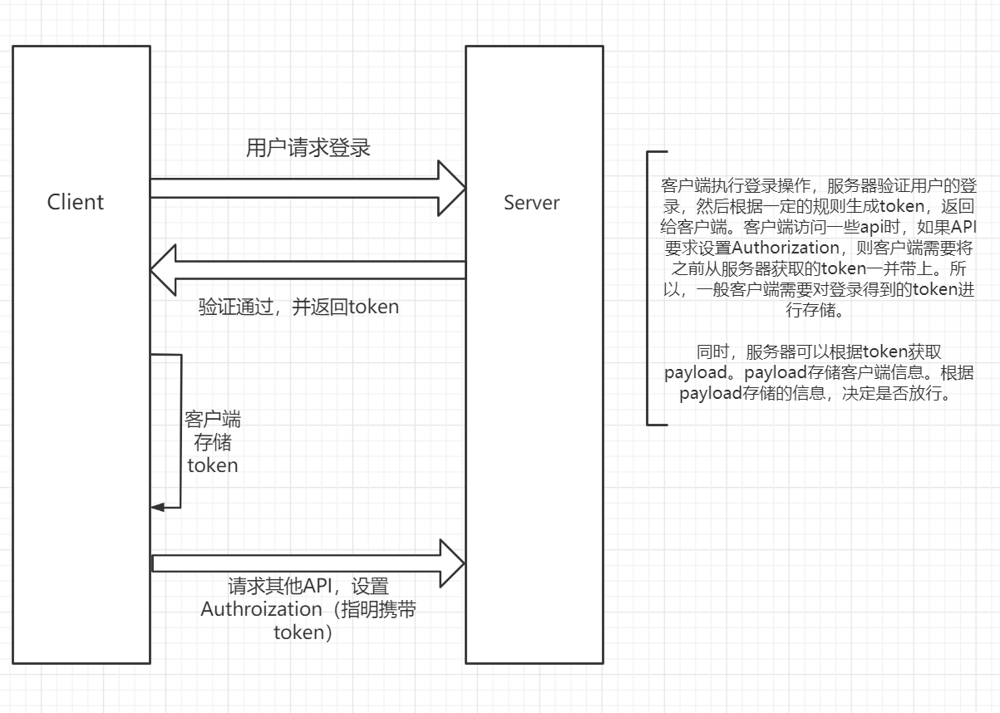

## token的原理

客户端发起登录请求，服务器接收到登录请求后，如果验证通过，则发给客户端一个`token`，来标识一个用户。也就是说，`token`的最主要作用就是来标识一个用户。

原理大致如下：

```ts
const user1Token = '1234';
const users = [user1Token, user2Token, ...]
```

既然，`token`可以作为`id`（唯一性）来标识一个用户，那么我们也可以用一个`map`进行保存，这样做的好处在于我们在标识唯一用户的同时，我们还可以附加一些属性(payload)。
```ts
const user1Payload = {
  username: 'user1'
  // ...
}
const users = {
  user1Token: user1Payload,
  user2Token: user2Payload,
}
```


用户完成登录后，得到服务器授予的`token`，将其保存下来，

## token的使用
