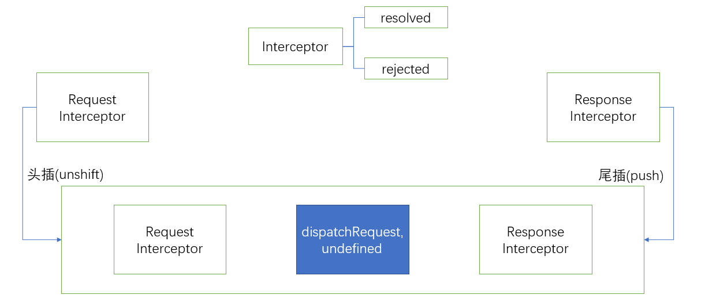

本文是基于[使用 Typescript 重构 axios](https://www.cnblogs.com/wangjiachen666/p/11234163.html)，以及 axios 源码学习的所思所想而写的。

## 处理输入

在设计程序的时候需要考虑用户的各种格式输入，不同格式的输入应适当进行区别处理。
这一点在 axios 中表现的最为明显，下面将以 axios 中处理 header 和处理 url 为例，探讨关于处理输入的处理方案。

### 处理 header

1. 统一输入格式。
   对于 header 的设定参差不齐，有些用户喜欢使用全小写（例如：`'content-type': 'application/json'`，有些采用首字母大写（例如：`'Content-Type': 'application/json'`等。对于这么多的输入格式，一种比较好的做法是将这些输入的格式进行统一处理。
   我们可以将用户的输入全部转换成大写，然后再执行下一步操作。
   这里需要注意的点是**我们将用户的输入转换成大写后，需要删除原先的输入，以避免重复。**
   下面节选自其中一段代码：
   ```ts
   function normalizeHeaderName(headers: any, normalizedName: string): void {
     if (!headers) {
       return
     }
     Object.keys(headers).forEach((name) => {
       // 统一处理用户的输入
       if (
         name !== normalizedName &&
         name.toUpperCase() === normalizedName.toUpperCase()
       ) {
         headers[normalizedName] = headers[name]
         // 删除旧键
         delete headers[name]
       }
     })
   }
   ```
2. 验证输入。
3. 统一输出格式。
   对于需要进行输入的操作，我们最好也要对输出进行统一。一般而言，统一的格式应当根据标准而定。
   例如：在设置 header 的时候，根据标准规定的请求和响应对应的 header 为首字母大写。于是，我们在设置 header 也应该满足该要求。这里附上添加 `Content-Type` 的代码段供参考。
   ```ts
   export function processHeaders(headers: any, data: any): any {
     normalizeHeaderName(headers, 'Content-Type')
     if (isObject(data)) {
       if (headers && !headers['Content-Type']) {
         // 采用标准的格式进行处理
         headers['Content-Type'] = 'application/json;charset=utf-8'
       }
     }
     return headers
   }
   ```

### 处理 url

axios 中处理请求 url 与 params 连接的操作非常有借鉴意义。
其采用了枚举的方式对不同类型的 params 和不同格式的 url 进行合并：

1. params 参数为普通参数。
2. params 参数为数组。
3. url 中含有 hash 值
4. ...

这提示我们在处理输入时，应当考虑不同的数据类型而设置不同的请求。处理枚举之外，对于其他值我们还可以设置默认值。

## function-oriented

function-oriented 最大的好处就是各司其职。与 command-oriented 相比，function-oriented 更能迫使我们写出高质量的代码。下面简单地介绍一下 function-oriented 和 command-oriented。

### function-oriented

考虑如下的场景：我们早上从起床到坐车上班需要做什么事情？
一般来说，从起床到坐车去上班需要经历如下的过程：

1. 洗漱（wash）。

- 刷牙（brushYourTeeth）。
- 洗脸（washYourFace）。
- 打扮（dressUp）。

2. 出门（go out）。

- 穿鞋（putOnShoes）。
- 关门（closeTheDoor）。
- 下楼（goDownstairs）。

3. 坐车（by car）。

- 打车（callCar）。
- 坐车（takeCar）。

我们将上面的过程翻译成代码：

```ts
function goToWorkByCar() {
  wash()
  goOut()
  byCar()
}

function wash() {
  brushYourTeeth()
  washYourFace()
  dressUp()
}

function goOut() {
  putOnShoes()
  closeTheDoor()
  goDownstairs()
}

function byCar() {
  callCar()
  takeCar()
}
```

通过上面的示例，我们可以知道 function-oriented 就是将程序的整个流程用函数填充，每个函数各司其职。
显然，function-oriented 最大的好处就是使得我们逻辑清晰，也方便我们后续 code review & debugger。

### command-oriented

何为 command-oriented？
还是以上面起床到坐车去上班为例，采用 command-oriented 后的代码如下：

```ts
function goToWorkByCar() {
  // wash
  // goOut
  // byCar
}

// ...
```

事实上，command-oriented 的思想与 function-oriented 差不多，取而代之的是采用 command 去实现程序流程。

### 优缺点

function-oriented 与 command-oriented 没有绝对的好坏之分。两种方法都对我们编程高质量代码提供行而有效的方式。

- 性能上看，function-oriented 的性能要弱于 command-oriented。
  之所以这么说，是因为 function-oriented 是借助函数实现程序开发流程的，总所周知，函数在调用的时候都会有开销的，所以性能要稍微弱于 command-oriented。
- 可读性和可维护性上看，function-oriented 要比 command-oriented 强得多。
  对于大部分人来说，编写 command 本身就是一件痛苦的事，更别说维护了。所以经常会出现没有 command 或者 command 滞后。但是，使用 function-oriented 进行开发的好处就是如果我们没能对函数进行实现的话，程序直接给我们抛出错误。

综上，多数情况下采用 function-oriented 进行开发后期的维护和调试都会方便很多，对于小的代码段，我们可以使用 command-oriented 来使我们的程序结构更加清晰明了。

## 拦截器

axios 的拦截器设计十分巧妙。它巧妙利用 Promise 的链式调用和一个双向链表实现的。来看具体的原理图：


1. 重复最初的请求。
2. 请求拦截器采用头插法( unshift )插入到 PromiseChain 中。
3. 相应拦截器采用尾插法( push )插入到 PromiseChain 中。

```ts
const chain: PromiseChainNode[] = [
  {
    // 存放最初的请求，通过当前结点之前的结点得到 config(后续会讲到)。
    resolved: dispatchRequest,
    rejected: undefined
  }
]

interceptors.request.forEach((interceptor) => {
  chain.unshift(interceptor)
})

interceptors.response.forEach((interceptor) => {
  chain.push(interceptor)
})
```

使用步骤如下：

1. 初始化一个 Promise，并将请求的 config 作为 Promise resolved 的结果。
2. 不断地从 PromiseChain 中取出 interceptor。执行 `promise.then(resolved, reject)` 得到一个新的 promise，如此往复，直到拦截器队列为空，则执行结束。

**NOTE**: 其中最值得一提的点是执行 Request Interceptor 时，`promise.then` 得到的 `value` 为 `AxiosRequestConfig`。执行完成后执行 `dispatchRequest`，得到 `AxiosResponse`。然后再执行 Response Interceptor，最后输出结果。

```ts
let promise = Promise.resolve(config)
while (chain.length) {
  const { resolved, rejected } = chain.shift()
  promise = promise.then(resolved, rejected)
}
const chain: PromiseChainNode<any>[] = [
  {
    resolved: dispatchRequest,
    rejected: undefined
  }
]

this.interceptors.request.forEach((interceptor) => {
  chain.unshift(interceptor)
})

this.interceptors.response.forEach((interceptor) => {
  chain.push(interceptor)
})
return promise as any
```

## 总结

1. 处理输入的方式。
2. 函数导向。
3. 拦截器 / 链表 / 双向队列 / Promise

## Appendix

### 参考资料

- [有哪些新手程序员不知道的小技巧？](https://www.zhihu.com/question/36426051/answer/151964584)
