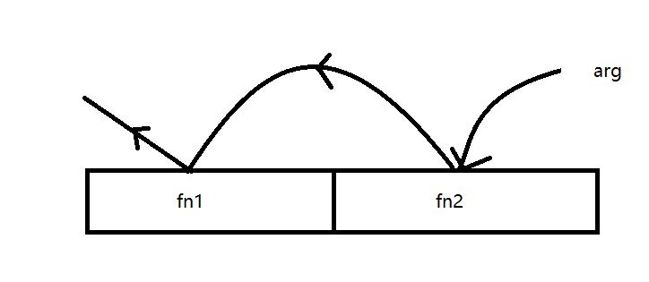

在`unix-like`系统上，我们可以在终端使用管道`|`来实现组合调用，也就是一个函数的输出是作为另一个函数的输入。例如下面的命令：
`echo hello | grep e`

`echo hello`会在终端输出`hello`，而通过`|`，我们将输出的结果传给`grep`。

那么，我们是否也可以用函数式编程的方式，实现上述功能。
回顾我们之前图书列表的例子[example](./1_3.fp_array/#examples-3)，我们在图书列表中将评分达到 9.5 的图书过滤出来，同时筛选出`author`和`title`字段，我们是通过如下代码实现的：

```ts
const filteredDetails = map(
  filter(bookList, (item) => item.rating[0] >= 9.5),
  (item) => {
    return { author: item.author, title: item.title }
  }
)
```

我们将`filter`得到的结果作为`map`的输入，这种行为是否与`unix-like`中的管道`|`类似？我们是也可以用管道来实现该需求？
当然可以，在讲管道之前我们先来介绍一下`compose`函数。

## 组合（compose）

### introduction

`compose`函数顾名思义就是组合的意思，我们可以将多个函数组合起来变成一个函数。它接收一个函数的输出，然后作为下一个函数的输入，同时，我们把这个过程封装成一个函数。来下实现就知道是什么意思了。

### implementation

我们先来实现我们第一个版本的`compose`函数，之所以是第一个版本，是因为它只能接收有限个参数(2 个)。

```ts
const compose = <T = any, R = any>(fn1: Function, fn2: Function) => (
  arg: T
): R => fn1(fn2(arg))
```

我们第一个版本的`compose`接收两个函数，返回一个新的函数。从`compose`函数的实现我们可以知道`fn2`执行的结果作为`fn1`的参数。


整个过程如同穿针一般，实现参数的传递。
值得注意的是这里函数的执行顺序是**从右往左**执行。

### application

有了`compose`函数，我们就可以实现执行有趣的功能。来看下面的例子：

我们将准备解析一个浮点数的字符串，同时将其四舍五入取整。例如：

```ts
const floatNumberStr = '4.65'
let f = parseFloat(floatNumberStr)
let result = Math.round(f)
console.log(result)
// 5
```

我们可以通过组合函数的方式，将上面的代码进行简化：

```ts
const floatNumberStr = '4.65'
const number = compose<string, number>(Math.round, parseFloat)
const result = number(floatNumberStr)
console.log(result)
```

这样做看似没有对代码进行简化，实则我们将解析浮点数和四舍五入的步骤都封装到一个函数里面，后续的调用我们完全可以通过组合后的函数进行调用，从而实现代码的复用。

类似的方法，如果我们想计算一下一个句子中有多少个单词，我们也可以用组合的方式实现：

```ts
const splitIntoSpaces = (str: string) => str.split(' ')
const count = (arr: string[]) => arr.length
const countWords = compose<string, number>(count, splitIntoSpaces)
const result = countWords('I am so happy today!')
console.log(result)
// 5
```

我们先创建两个辅助函数，一个用于将字符串按照空格切割，一个就是统计切割后的数组长度。然后通过`compose`，将这两个函数组合在一起。(这里这是作为演示，当然有其他简单的办法实现)

### 引入柯里化和偏应用

从上面`compose`的实现我们可以感受到组合函数的魅力。回顾一下我们之前实现的`map`和`filter`，这两个数组函数接收两个参数，一个是数组还有一个是对应的回调函数，正因如此，我们无法简单地将这两个函数组合在一起。为了我们的数组函数也能使用`compose`，我们可以想到用`curry`或者`partial`将我们的函数转换成只接收一个参数的函数。
来看之前的图书列表，我们还是想从中获取到`author`和`title`字段，但是与上次不同，我们的评分标准可以由我们自己决定。
这里先附上图书列表：

```ts
const bookList: BookList = [
  {
    id: 1,
    title: '围城',
    author: '钱钟书',
    rating: [9.5],
    reviews: [{ excellent: 4, good: 5 }]
  },
  {
    id: 2,
    title: '三国演义',
    author: '罗贯中',
    rating: [9.7],
    reviews: []
  },
  {
    id: 3,
    title: 'how to stop worrying and start living',
    author: 'Dale Carnegie',
    rating: [9.2],
    reviews: [{ good: 4 }]
  }
]
```

我们先定义一些小函数来帮助我们对数组函数(`map`, `filter`)“扁平化”：

```ts
interface TitleAndAuthor {
  title: string
  author: string
}
const filterOutstandingBook = (book: BookItem) => book.rating[0] > 9.5
const filterGoodBook = (book: BookItem) => book.rating[0] > 9
const filterNormalBook = (book: BookItem) => book.rating[0] < 8.5

const projectAuthor = (book: BookItem) => book.author
const projectTitle = (book: BookItem) => book.title
const projectAuthorAndTitle = (book: BookItem) => ({
  author: book.author,
  title: book.title
})

const queryOutstandingBook = partial(filter, undefined, filterOutstandingBook)
const mapTitleAndAuthor = partial(map, undefined, projectAuthorAndTitle)
```

通过将创建的小函数“扁平化”，我们可以实现不同需要的组合函数的`components`。来看具体的使用：

```ts
const titleAndAuthorForGoodBooks = compose<BookList, TitleAndAuthor[]>(
  mapTitleAndAuthor,
  queryOutstandingBook
)

const result = titleAndAuthorForGoodBooks(bookList)
console.log(result)
// [ { author: '罗贯中', title: '三国演义' } ]
```

我们把`bookList`传给组合后的函数`titleAndAuthorForGoodBooks`，该函数先执行：`queryOutstandingBook(bookList)`，而`queryOutstandingBook`实际执行的是`filter(bookList, filterOutstandingBook)`（这是因为我们用`partial`“扁平化”），这样我们就从`bookList`中过滤出评分是`outstanding`的图书(`bookItem[] = [{id: 2, title: '三国演义', author: '罗贯中', rating: [9.7], reviews: []}]`)。
得到结果后，我们将结果作为 `mapTitleAndAuthor`的输入，道理与`queryOutstandingBook`类似。

从上面的例子我们可以看到，\*\*`compose`的思想就是把小函数组合成一个大函数。`简单的函数容易阅读、测试和维护。

### improvement

接下来，我们要对`compose`进行升级，这一次，我们想让我们的`compose`可以接收不定长的参数。具体实现如下：

```ts
import utils from '../arrayUtils'
const { reduce } = utils
const compose = <T = any, R = any>(...fns: Function[]) => (arg: T): R[] =>
  reduce(fns.reverse(), (acc, fn) => fn(acc), arg as any)
```

核代码为`reduce(fns.reverse(), (acc, fn) => fn(acc), arg)`。
我们还是用之前的例子来说明情况：

```ts
const floatNumberStr = '4.65'
let f = parseFloat(floatNumberStr)
let result = Math.round(f)
console.log(result)
// [5]
```

首先，对我们传入的参数进行反转`fns.reverse()`，之所以要反转是因为`reduce`的执行顺序是**从左往右**执行的，而我们的`compose`是从右往左执行的。
反转后得到`[parseFloat, Math.round]`，然后执行我们的`reduce`函数。
还记得我们的`reduce`函数的作用？它会从左往右依次执行数组中的函数，然后规约到一个单一值的数组。在这里例子中，它会依次执行`[parseFloat, Math.round]`。并且将`'4.65'`作为初始值。所以先执行`parseFloat('4.65')`，得到`4.65`然后返回到`acc`累加器中，下一轮迭代时执行`Math.round(4.65)`，然后执行完毕。

现在，我们可以用新的`compose`来组合更多的函数了，来看下面的例子：

```ts
const splitIntoSpaces = (str: string) => str.split(' ')
const count = (arr: string[]) => arr.length
const oddOrEven = (n: number) => (n % 2 === 0 ? 'even' : 'odd')
const oddOrEvenWords = compose(oddOrEven, count, splitIntoSpaces)
const result = oddOrEvenWords('I am so happy today!')
console.log(result)
// ['odd']
```

和之前类似，我们先统计一段话中单词的个数，然后判断单词个数是奇数还是偶数。

## 管道（pipe）

### introduction

从上面`compose`的实现我们可以看到，`compose`的组合执行顺序是**从右往左**执行的。然而，`unix-like`中的管道`|`执行顺序是**从左往右**执行的。而且，`compose`函数的作用跟管道非常类似，只是执行顺序不同，那么我们能否通过修改`compose`函数的代码来实现`pipe`？其实上只需要简单地修改一行代码就可以实现`pipe`函数。

### implementation

```ts{5}
import utils from '../arrayUtils'
const { reduce } = utils

const pipe = <T = any, R = any>(...fns: Function[]) => (arg: T): R[] =>
  reduce(fns, (acc, fn) => fn(acc), arg as any)
```

我们只需要将`compose`中对函数数组`fns`的反转删除即可。

### application

还是之前的例子，这一次我们用`pipe`实现，只需要将`pipe`中的参数按照从左到右摆放即可。

```ts
import pipe from './pipe'
function pipeExample1() {
  const splitIntoSpaces = (str: string) => str.split(' ')
  const count = (arr: string[]) => arr.length
  const oddOrEven = (n: number) => (n % 2 === 0 ? 'even' : 'odd')
  const oddOrEvenWords = pipe(splitIntoSpaces, count, oddOrEven)
  const result = oddOrEvenWords('I am so happy today!')
  console.log(result)
  // ['odd']
}

pipeExample1()
```

## 组合的优势

函数式组合是满足结合律的，即`compose(f, compose(g, h)) == compose(compose(f, g), h)`。
使用组合真正的好处在于它允许我们把函数组合到各自所需的`compose`函数中。
例如：

```ts
const countWords = compose(count, splitIntoSpaces)
const oddOrEvenWord = compose(oddOrEvenWord, countWords)

// or
const countOddEven = compose(oddOrEven, count)
const oddOrEvenWord = (countOddEven, splitIntoSpaces)
```

上面的代码能够正常运行是因为组合具有结合律的属性！！

#### 使用 tap 调试链式调用的中间结果

我们上面实现的`compose`的功能就是一个链式调用。但是，在实际生产中，这种链式调用和容易出现异常，例如我们想知道`compose(oddOrEven, count, splitIntoSpaces)`在执行到`count`时是否出现异常，我们该如何去做？
事实上我们可以在`count`和`splitIntoSpaces`中间再组合一个函数，用于调试：

```ts
const tap = <T = any>(value: T) => {
  console.log('tapping: value = ')
  console.log(value)
  return value
}

const splitIntoSpaces = (str: string) => str.split(' ')
const count = (arr: string[]) => arr.length
const oddOrEven = (n: number) => (n % 2 === 0 ? 'even' : 'odd')
const oddOrEvenWords = compose2(oddOrEven, count, tap, splitIntoSpaces)
const result = oddOrEvenWords('I am so happy today!')
console.log(result)
// tapping: value =
// [ 'I', 'am', 'so', 'happy', 'today!' ]
// [ 'odd' ]
```

只需要一个小函数`tap`我们就可以再链式调用过程中进行简单的调试！！

## wrap up

我们通过`compose`和`pipe`实现了类似`unix-like`中的管道`|`的功能，将输入和输出连接起来，我们就可以专注于其中某一个小部件的开发。这就是函数式编程的魅力所在，通过用许多小函数组合成为大的函数，每个小函数逻辑清晰，简洁且方便调试。
