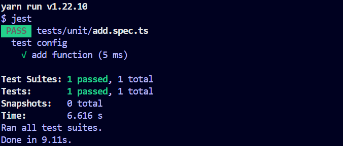

#  ts函数式编程初探--环境配置

## 初始化

```bash
yarn init --yes

# nodemon用与dev测试
# jest用于单元测试
yarn add --dev typescript ts-node nodemon @types/node jest ts-jest @types/jest
# 添加babel转义
yarn add --dev babel-jest @babel/core @babel/preset-env @babel/preset-typescript

# 初始化项目文件
mkdir ./src
mkdir ./tests
cd ./tests
mkdir ./unit
```

## 配置

### typescript 配置

在根目录下，执行`tsc --init`初始化`typescript`配置：

```ts
{
  "compilerOptions": {
    "target": "es5",
    "module": "commonjs", 
    "sourceMap": true, 
    "outDir": "./dist", 
    "rootDir": "./src", 
    "strict": true,
    "baseUrl": "./",
    "types": ["jest"],
    "esModuleInterop": true,
    "skipLibCheck": true,
    "forceConsistentCasingInFileNames": true
  },
  "include": ["src/**/*.ts", "src/**/*.d.ts", "src/**/*.tsx", "src/**/*.vue", "tests"]
}
```

### jest配置

在项目的根目录下，创建`jest.config.js`进行配置：

```js
// @/jest.config.js
module.exports = {
  transform: {
    '^.+\\.tsx?$': 'ts-jest',
  }
}
```


这里需要借助`babel`进行转义，在项目根目录下创建`babel.config.js`进行配置：

```js
// @/babel.config.js
module.exports = {
  presets: [['@babel/preset-env', {targets: {node: 'current'}}]],
}
```


### 第一个测试用例

添加测试用例。我们尝试在`@/src`创建一个`add.ts`，来测试我们的配置：

```ts
// @/src/add.ts
export default function add (a: number, b: number): number {
  return a + b
}
```


添加测试用例。在`@/tests/unit`中创建`add.spec.ts`测试`add`函数：

```ts
// @/tests/unit/add.spec.ts
import add from '../../src/add'

describe('test config', () => {
  test('add function', () => {
    expect(add(1, 2)).toBe(3)
  })
})
```


配置测试脚本。在`@/package.json`中添加测试脚本：

```json
// @/package.json
"scripts": {			// <==
  "test:unit": "jest"	// <==
}						// <==
```


运行测试脚本。`yarn test:unit`后终端会出现如下字样，表示配置成功：



